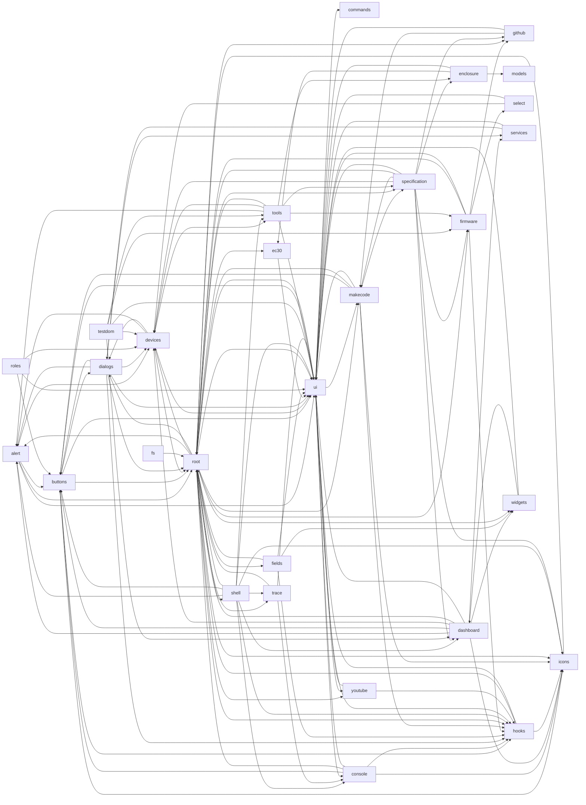

# Component Dependency Diagram

Generated from 397 component files, grouped into 29 folders with 128 inter-folder dependency edges.

```mermaid
flowchart LR
    n_alert["alert"]
    n_buttons["buttons"]
    n_commands["commands"]
    n_console["console"]
    n_dashboard["dashboard"]
    n_devices["devices"]
    n_dialogs["dialogs"]
    n_ec30["ec30"]
    n_enclosure["enclosure"]
    n_fields["fields"]
    n_firmware["firmware"]
    n_fs["fs"]
    n_github["github"]
    n_hooks["hooks"]
    n_icons["icons"]
    n_makecode["makecode"]
    n_models["models"]
    n_roles["roles"]
    n_root["root"]
    n_select["select"]
    n_services["services"]
    n_shell["shell"]
    n_specification["specification"]
    n_testdom["testdom"]
    n_tools["tools"]
    n_trace["trace"]
    n_ui["ui"]
    n_widgets["widgets"]
    n_youtube["youtube"]
    n_alert --> n_buttons
    n_alert --> n_devices
    n_alert --> n_root
    n_alert --> n_ui
    n_buttons --> n_dialogs
    n_buttons --> n_hooks
    n_buttons --> n_icons
    n_buttons --> n_root
    n_buttons --> n_ui
    n_console --> n_buttons
    n_console --> n_hooks
    n_console --> n_icons
    n_console --> n_root
    n_console --> n_ui
    n_dashboard --> n_alert
    n_dashboard --> n_buttons
    n_dashboard --> n_devices
    n_dashboard --> n_icons
    n_dashboard --> n_root
    n_dashboard --> n_services
    n_dashboard --> n_ui
    n_dashboard --> n_widgets
    n_devices --> n_alert
    n_devices --> n_dialogs
    n_devices --> n_root
    n_devices --> n_tools
    n_devices --> n_ui
    n_dialogs --> n_alert
    n_dialogs --> n_buttons
    n_dialogs --> n_devices
    n_dialogs --> n_hooks
    n_dialogs --> n_root
    n_dialogs --> n_services
    n_dialogs --> n_ui
    n_ec30 --> n_ui
    n_enclosure --> n_ec30
    n_enclosure --> n_models
    n_enclosure --> n_ui
    n_fields --> n_hooks
    n_fields --> n_root
    n_fields --> n_ui
    n_fields --> n_widgets
    n_firmware --> n_github
    n_firmware --> n_hooks
    n_firmware --> n_root
    n_firmware --> n_select
    n_firmware --> n_ui
    n_fs --> n_root
    n_github --> n_makecode
    n_github --> n_ui
    n_hooks --> n_icons
    n_hooks --> n_root
    n_hooks --> n_ui
    n_icons --> n_root
    n_makecode --> n_buttons
    n_makecode --> n_hooks
    n_makecode --> n_icons
    n_makecode --> n_root
    n_makecode --> n_specification
    n_makecode --> n_ui
    n_roles --> n_buttons
    n_roles --> n_devices
    n_roles --> n_ui
    n_root --> n_alert
    n_root --> n_devices
    n_root --> n_dialogs
    n_root --> n_ec30
    n_root --> n_fields
    n_root --> n_firmware
    n_root --> n_github
    n_root --> n_hooks
    n_root --> n_icons
    n_root --> n_makecode
    n_root --> n_shell
    n_root --> n_specification
    n_root --> n_trace
    n_root --> n_ui
    n_root --> n_widgets
    n_root --> n_youtube
    n_select --> n_devices
    n_select --> n_ui
    n_services --> n_dialogs
    n_services --> n_ui
    n_shell --> n_alert
    n_shell --> n_buttons
    n_shell --> n_console
    n_shell --> n_dashboard
    n_shell --> n_hooks
    n_shell --> n_icons
    n_shell --> n_root
    n_shell --> n_tools
    n_shell --> n_trace
    n_shell --> n_ui
    n_specification --> n_dashboard
    n_specification --> n_devices
    n_specification --> n_enclosure
    n_specification --> n_firmware
    n_specification --> n_github
    n_specification --> n_icons
    n_specification --> n_makecode
    n_specification --> n_root
    n_specification --> n_ui
    n_testdom --> n_dashboard
    n_testdom --> n_devices
    n_testdom --> n_firmware
    n_testdom --> n_tools
    n_testdom --> n_ui
    n_tools --> n_alert
    n_tools --> n_devices
    n_tools --> n_enclosure
    n_tools --> n_firmware
    n_tools --> n_root
    n_tools --> n_specification
    n_tools --> n_ui
    n_trace --> n_console
    n_trace --> n_root
    n_trace --> n_ui
    n_ui --> n_buttons
    n_ui --> n_commands
    n_ui --> n_console
    n_ui --> n_hooks
    n_ui --> n_makecode
    n_ui --> n_root
    n_ui --> n_youtube
    n_widgets --> n_dashboard
    n_widgets --> n_ui
    n_youtube --> n_hooks
    n_youtube --> n_ui
```
