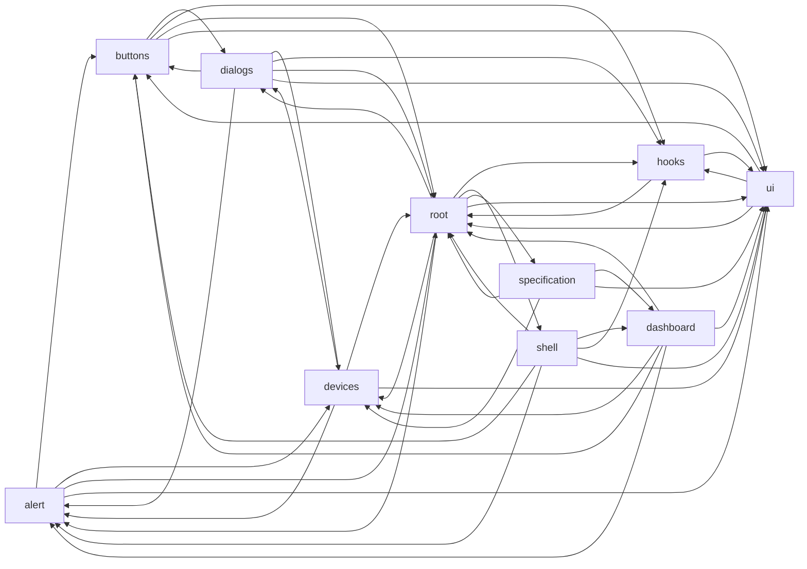

# Component Dependency Diagram

Generated from 397 component files, grouped into 10 folders with 45 inter-folder dependency edges after keeping the top 10 busiest folders.

```mermaid
flowchart LR
    n_alert["alert"]
    n_buttons["buttons"]
    n_dashboard["dashboard"]
    n_devices["devices"]
    n_dialogs["dialogs"]
    n_hooks["hooks"]
    n_root["root"]
    n_shell["shell"]
    n_specification["specification"]
    n_ui["ui"]
    n_alert --> n_buttons
    n_alert --> n_devices
    n_alert --> n_root
    n_alert --> n_ui
    n_buttons --> n_dialogs
    n_buttons --> n_hooks
    n_buttons --> n_root
    n_buttons --> n_ui
    n_dashboard --> n_alert
    n_dashboard --> n_buttons
    n_dashboard --> n_devices
    n_dashboard --> n_root
    n_dashboard --> n_ui
    n_devices --> n_alert
    n_devices --> n_dialogs
    n_devices --> n_root
    n_devices --> n_ui
    n_dialogs --> n_alert
    n_dialogs --> n_buttons
    n_dialogs --> n_devices
    n_dialogs --> n_hooks
    n_dialogs --> n_root
    n_dialogs --> n_ui
    n_hooks --> n_root
    n_hooks --> n_ui
    n_root --> n_alert
    n_root --> n_devices
    n_root --> n_dialogs
    n_root --> n_hooks
    n_root --> n_shell
    n_root --> n_specification
    n_root --> n_ui
    n_shell --> n_alert
    n_shell --> n_buttons
    n_shell --> n_dashboard
    n_shell --> n_hooks
    n_shell --> n_root
    n_shell --> n_ui
    n_specification --> n_dashboard
    n_specification --> n_devices
    n_specification --> n_root
    n_specification --> n_ui
    n_ui --> n_buttons
    n_ui --> n_hooks
    n_ui --> n_root
```
